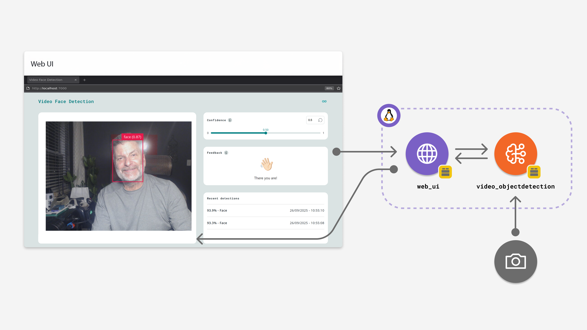

# Face Detector on Camera


Welcome to the **Face Detector on Camera** project! 📸✨

This application transforms your Arduino UNO Q into a smart vision device. It captures a live video feed from a USB camera, uses Artificial Intelligence to detect faces in real-time, and draws bounding boxes around the detections. It's a perfect example of how easy it is to integrate computer vision into your IoT projects using the Arduino App Lab.



---

## ⚠️ Important Note
**Network Mode Required:** To run this example successfully, you must use **Network Mode** in the Arduino App Lab. This setup requires a USB-C hub and a USB camera connected to your board.

---

## 🛠️ Hardware & Software Requirements

To get started, you'll need the following gear:

### Hardware
*   **[Arduino® UNO Q](https://store.arduino.cc/products/uno-q)** 
*   **USB Camera**: Any standard USB webcam will do.
*   **USB-C® Hub Adapter**: Must support external power.
*   **Power Supply (5V, 3A)**: To power the USB hub (a standard phone charger works well).
*   **PC**: With internet access to view the interface.

### Software
*   **Arduino App Lab**: The platform for running your Python bricks.

---

##  How to Use This Example

Follow these simple steps to get your face detector up and running:

1.  **Connect the Hardware**: Plug your USB-C hub into the UNO Q, then connect your USB camera to the hub.
    

2.  **Power Up**: Connect your external power supply to the USB-C hub. This ensures both the board and the camera have enough juice.

3.  **Launch the App**: Start the application from the Arduino App Lab.
    

4.  **Access the Interface**: The app should automatically open in your default web browser. If it doesn't, you can manually visit:
    `http://<board-name>.local:7000`

5.  **Test It Out**: Stand in front of the camera. The app will detect your face, draw a box around it, and even say "Hi"! 👋

---

##  How It Works

This project is a full-stack application that combines a Python backend with a web-based frontend.

### The Backend (`main.py`)
The backend runs on the Arduino UNO Q. It handles the heavy lifting:
*   **Initialization**: Sets up the Web UI and the Video Object Detection bricks.
*   **Detection**: Continuously analyzes video frames. When a face is found, it triggers an event.
*   **Communication**: Sends detection data (confidence scores, timestamps) to the frontend via WebSockets.

### The Frontend (`index.html` + `app.js`)
The frontend runs in your browser. It provides the visual interface:
*   **Video Feed**: Displays the live stream from the camera.
*   **Controls**: Allows you to adjust the "Confidence Threshold" (how sure the AI needs to be before it marks a face).
*   **Feedback**: Shows animations and logs recent detections.

---

## 💻 Code Walkthrough

Here is a closer look at the code that makes this happen, with comments to help understand each part.

### Backend Logic

The Python script initializes the bricks and defines how to handle detection events.

```python
from arduino.app_bricks.web_ui import WebUI
from arduino.app_bricks.video_objectdetection import VideoObjectDetection
from datetime import datetime, UTC

# Initialize the Web Interface brick
ui = WebUI()

# Initialize the Video Object Detection brick for the camera
detection_stream = VideoObjectDetection()

# Listen for 'override_th' messages from the frontend to adjust sensitivity
ui.on_message("override_th",
              lambda sid, threshold: detection_stream.override_threshold(threshold))

def face_detected():
    # Simple callback to log when a face is found
    print("Face detected!")

# Register the callback for specific 'face' events
detection_stream.on_detect("face", face_detected)

# Register a handler to process all detections and send them to the UI
detection_stream.on_detect_all(send_detections_to_ui)

def send_detections_to_ui(detections: dict):
    # Loop through all detected objects
    for key, value in detections.items():
        # Create a data packet with the label, confidence score, and time
        entry = {
            "content": key,
            "confidence": value,
            "timestamp": datetime.now(UTC).isoformat()
        }
        # Send this data to the browser via WebSocket
        ui.send_message("detection", message=entry)

# Start the application loop
App.run()
```

### Frontend Logic

The JavaScript handles the real-time updates in the browser.

```javascript
// Connect to the WebSocket server hosted by the board
const socket = io(`http://${window.location.host}`);

// Listen for 'detection' messages sent from the Python backend
socket.on('detection', (message) => {
    // Log the detection in the history list
    printDetection(message);
    
    // Re-render the list on the screen
    renderDetections();
    
    // Trigger visual feedback (like the waving hand animation)
    // Note: updateFeedback is a helper function defined in app.js
    updateFeedback(); 
});

// Example of sending data back to the board (e.g., when slider moves)
// socket.emit("override_th", newValue);
```

---

##  Editorial: The Double-Edged Sword of Facial Recognition

Facial recognition technology, like the one demonstrated in this simple example, is becoming ubiquitous in our modern world. While it offers exciting possibilities, it also raises important questions.

**The Pros:**
*   **Security & Safety**: Used in airports and secure facilities to verify identity quickly.
*   **Convenience**: Unlocking phones or tagging friends in photos automatically saves time.
*   **Accessibility**: Can help visually impaired users identify people around them.

**The Cons:**
*   **Privacy**: The ability to track individuals in public spaces without consent is a major privacy concern.
*   **Bias & Accuracy**: AI models can sometimes exhibit bias, leading to unfair treatment.
*   **Surveillance**: Widespread use can lead to a "surveillance state" where anonymity is lost.

As developers, it is crucial to understand these implications and use this powerful technology responsibly and ethically.
